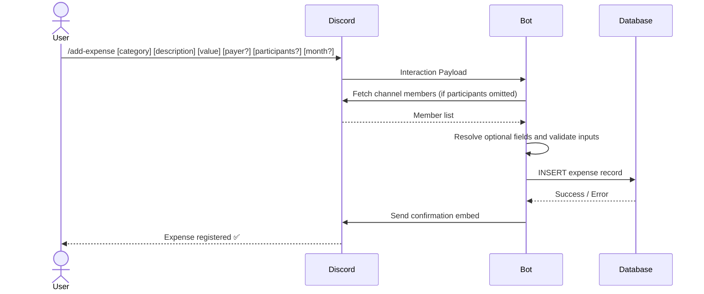
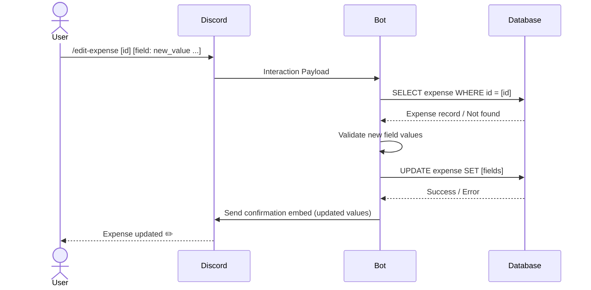
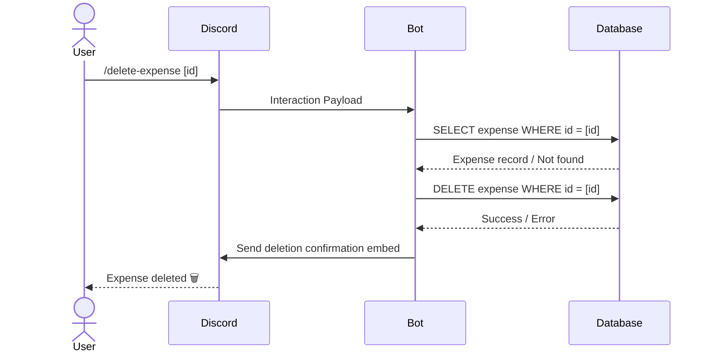
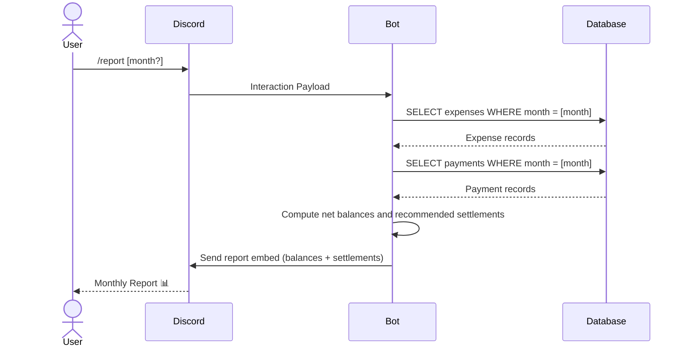
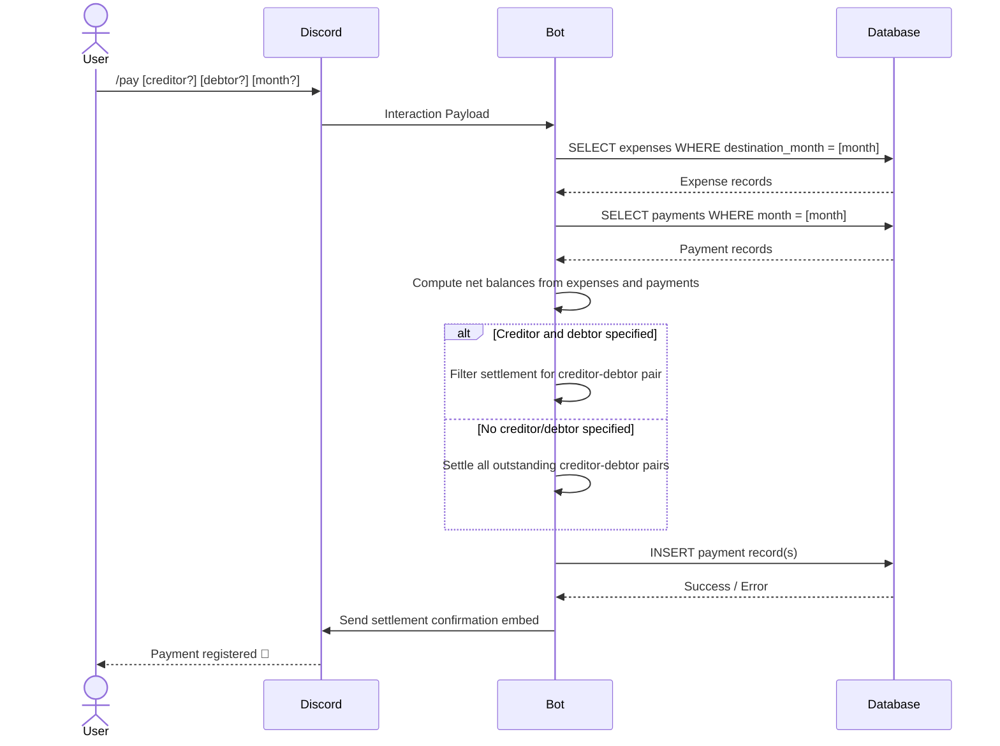
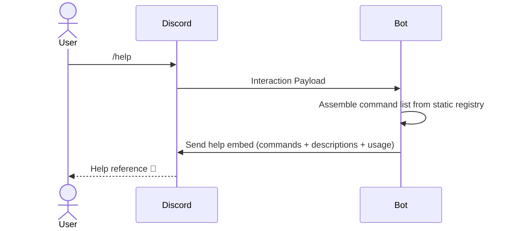
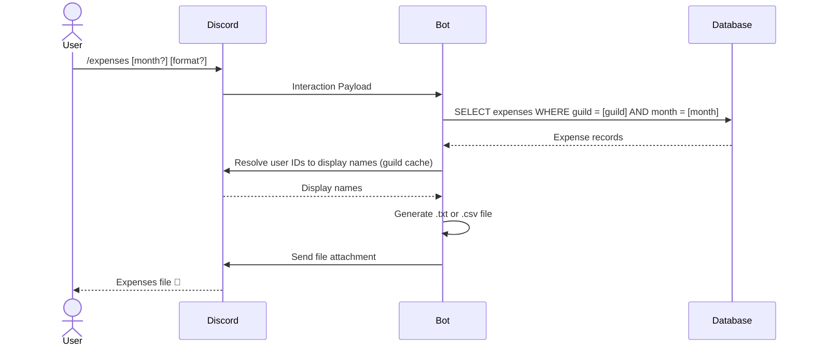
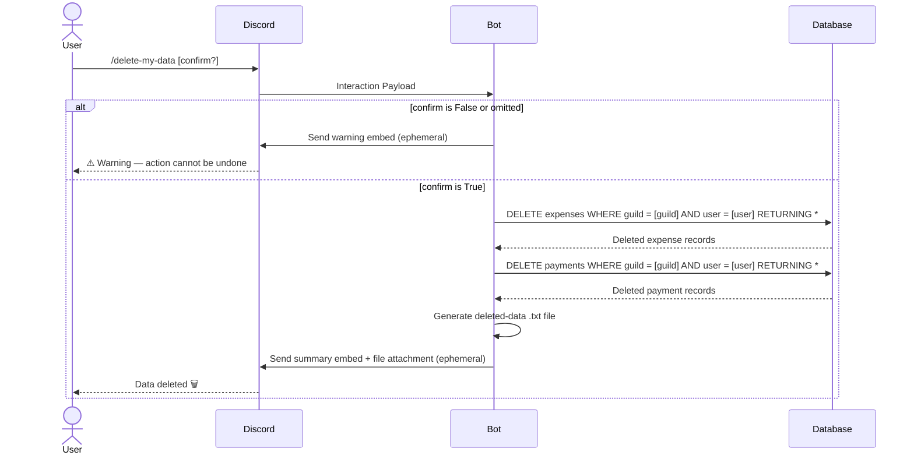

# Pawments Bot — Technical Documentation

---

## 1. Overview

### Objective

**Pawments Bot** is a Discord bot that enables groups of people to track shared expenses, generate financial reports, and register payments between members — all without leaving the Discord environment.

It is designed to solve the common problem of splitting costs among groups (roommates, travel companions, event organizers, etc.) by automating the calculation of balances, credits, and debits per month.

### Scope

#### Included

- Registration of shared expenses with metadata (category, description, value, payer, participants, target month)
- Automatic inference of payer, participants, and target month when not explicitly provided
- Editing of previously registered expenses
- Deletion of previously registered expenses
- Generation of monthly financial reports with per-person net balances and recommended settlements
- Export of monthly expenses as a `.txt` or `.csv` file attachment
- Registration of payments between members (full or partial settlement)
- Automatic settlement of all outstanding credits when no specific creditor/debtor is specified
- Per-user data deletion on request, scoped to the current server
- Multi-guild isolation: each server's data is fully independent
- In-Discord help reference listing all available commands, parameters, and usage examples

#### Excluded

- Integration with external payment platforms (e.g., PayPal, Pix, Stripe)
- Currency conversion or multi-currency support
- User authentication beyond Discord's native identity system

---

## 2. Requirements

### 2.1 Functional Requirements

| ID | Description |
|----|-------------|
| FR-01 | The bot must allow a user to register a shared expense with the following fields: **category**, **description**, **value**, **paying person**, **involved people**, and **destination month**. |
| FR-02 | If no **paying person** is specified, the bot must automatically assign the command author as the payer. |
| FR-03 | If no **involved people** are specified, the bot must automatically include all members currently in the channel as expense participants. |
| FR-04 | If no **destination month** is specified, the bot must default to the current calendar month. |
| FR-05 | The bot must allow a user to edit any field of a previously registered expense by its ID. |
| FR-06 | The bot must allow a user to delete a previously registered expense by its ID. |
| FR-07 | The bot must generate a monthly financial report containing per-person net balances and recommended settlements. The report must not include the full expense list inline; users must use `/expenses` to export expenses. |
| FR-08 | The bot must allow a user to register a payment from a specific creditor to a specific debtor for a given month. |
| FR-09 | If no creditor and no debtor are specified during payment registration, the bot must automatically settle all outstanding credits for the month. |
| FR-10 | The bot must provide a `/help` command that lists all available commands with their descriptions, parameters, and usage examples. |
| FR-11 | The bot must allow a user to export all expenses for a given month as a file attachment (`.txt` by default, `.csv` optionally). Payer and participant Discord user IDs must be resolved to display names. Each entry must include the date the expense was added. |
| FR-12 | The bot must allow a user to permanently delete all their expense and payment records from the current server. The command must require explicit confirmation and respond with a `.txt` file listing everything deleted. |

### 2.2 Non-Functional Requirements

| ID | Category | Description |
|----|----------|-------------|
| NFR-01 | Fault Tolerance | If the database is unreachable, the bot must respond with a user-friendly error message and not crash. |
| NFR-02 | Data Integrity | Expense and payment records must be persisted atomically; partial writes must be rolled back. |
| NFR-03 | Auditability | All commands and their resolved parameters (including inferred values) must be logged. |
| NFR-04 | Usability | All bot responses must use Discord embeds with clear formatting, including success/error states. |
| NFR-05 | Privacy | Users must be able to permanently delete all personal data stored by the bot in a given server, on demand. |

---

## 3. Data Flow

### 3.1 Add Expense (`/add-expense`)

**Macro steps:**

1. User invokes the `/add-expense` command in a Discord channel.
2. The bot receives the interaction payload from the Discord Gateway.
3. The bot resolves optional fields: infers payer (command author), participants (all channel members), and month (current month) if not provided.
4. The bot validates the resolved inputs (e.g., positive value, valid month format).
5. The bot persists the expense record to the database.
6. The bot responds to the user with a confirmation embed.



---

### 3.2 Edit Expense (`/edit-expense`)

**Macro steps:**

1. User invokes the `/edit-expense` command with the expense ID and the fields to update.
2. The bot receives the interaction payload from the Discord Gateway.
3. The bot queries the database to verify the expense exists.
4. The bot validates the new field values.
5. The bot updates the expense record in the database.
6. The bot responds with a confirmation embed showing the updated values.



---

### 3.3 Delete Expense (`/delete-expense`)

**Macro steps:**

1. User invokes the `/delete-expense` command with the expense ID.
2. The bot receives the interaction payload from the Discord Gateway.
3. The bot queries the database to verify the expense exists.
4. The bot deletes the expense record from the database.
5. The bot responds with a deletion confirmation embed.



---

### 3.4 Request Monthly Report (`/report`)

**Macro steps:**

1. User invokes the `/report` command with a target month.
2. The bot queries the database for all expenses and payments of that month.
3. The bot calculates per-person net balances (paid vs. owed).
4. The bot generates the recommended settlements to zero out all balances.
5. The bot responds with an embed showing balances and settlements only. The full expense list is not included inline; users use `/expenses` to export it.



---

### 3.5 Register Payment (`/pay`)

**Macro steps:**

1. User invokes the `/pay` command, optionally specifying creditor, debtor, and month.
2. If creditor and debtor are omitted, the bot fetches all outstanding credits for the month.
3. The bot validates that the payment is consistent with the current balance.
4. The bot persists the payment record(s) to the database.
5. The bot responds with a settlement confirmation embed.



---

### 3.6 Help (`/help`)

**Macro steps:**

1. User invokes the `/help` command in a Discord channel.
2. The bot receives the interaction payload from the Discord Gateway.
3. The bot assembles the help embed from its static command registry (no database access required).
4. The bot responds with a formatted embed listing all available commands, their parameters, and usage examples.



---

### 3.7 Export Expenses (`/expenses`)

**Macro steps:**

1. User invokes the `/expenses` command with an optional month and format.
2. The bot queries the database for all expenses of that month.
3. If no expenses are found, the bot responds with an error embed.
4. The bot resolves Discord user IDs to display names using the guild member cache.
5. The bot generates the file (`.txt` or `.csv`) and sends it as an attachment.



---

### 3.8 Delete My Data (`/delete-my-data`)

**Macro steps:**

1. User invokes the `/delete-my-data` command.
2. If `confirm` is not `True`, the bot responds with a warning embed (ephemeral) and stops.
3. If confirmed, the bot deletes all expense records where the user is payer or participant, and all payment records where the user is creditor or debtor, scoped to the current server.
4. The bot generates a `.txt` file listing all deleted records.
5. The bot responds with a summary embed and the file attachment (ephemeral).



---

## 4. Data Sources

| Source | Type | Endpoint / Location | Authentication | Rate Limit / Notes |
|--------|------|---------------------|----------------|--------------------|
| Discord Gateway | WebSocket API | `wss://gateway.discord.gg` | Bot Token (Bearer) | Discord's default rate limits apply per route |
| Discord REST API | REST API | `https://discord.com/api/v10` | Bot Token (Bearer) | 50 requests/second global; per-route buckets |
| Application Database | Relational DB (PostgreSQL 16) | Internal (e.g., `localhost:5432/expenses`) | DB credentials (`POSTGRES_*` env vars) | Internal service; connection pooling required in production |

---

## 5. Data Contracts

### 5.1 Expense Record

**Commands:** `/add-expense`, `/edit-expense`, `/delete-expense`

| Field | Type | Required | Validation | Default |
|-------|------|----------|------------|---------|
| `id` | `string` (ULID) | ✅ (auto) | Unique identifier, generated on creation | Auto-generated |
| `category` | `string` | ✅ | Non-empty, max 100 chars | — |
| `description` | `string` | ✅ | Non-empty, free-form text | — |
| `value` | `number` | ✅ | Positive decimal, max 2 decimal places | — |
| `paying_person` | `string` (Discord User ID) | ❌ | Must be a valid Discord member | Command author |
| `involved_people` | `string[]` (Discord User IDs) | ❌ | Each must be a valid channel member | All channel members |
| `destination_month` | `string` | ❌ | Format: `YYYY-MM` | Current month |
| `guild_id` | `string` | ✅ (auto) | Discord guild snowflake | From interaction context |
| `channel_id` | `string` | ✅ (auto) | Discord channel snowflake | From interaction context |
| `created_at` | `datetime` | ✅ (auto) | ISO 8601 UTC | Server timestamp |
| `updated_at` | `datetime` | ✅ (auto) | ISO 8601 UTC; updated on every edit | Server timestamp |

**Example JSON (persisted):**

```json
{
  "id": "01J3KXYZABCDEFGHIJKLMNOPQR",
  "guild_id": "1234567890",
  "channel_id": "9876543210",
  "category": "Food",
  "description": "Pizza night",
  "value": 85.50,
  "paying_person": "111222333",
  "involved_people": ["111222333", "444555666", "777888999"],
  "destination_month": "2025-05",
  "created_at": "2025-05-07T21:00:00Z",
  "updated_at": "2025-05-07T21:00:00Z"
}
```

---

### 5.2 Edit Expense Request

**Command:** `/edit-expense`

| Field | Type | Required | Validation |
|-------|------|----------|------------|
| `id` | `string` | ✅ | Must reference an existing expense |
| `category` | `string` | ❌ | Non-empty, max 100 chars |
| `description` | `string` | ❌ | Non-empty, free-form text |
| `value` | `number` | ❌ | Positive decimal, max 2 decimal places |
| `paying_person` | `string` (Discord User ID) | ❌ | Must be a valid Discord member |
| `involved_people` | `string[]` (Discord User IDs) | ❌ | Each must be a valid channel member |
| `destination_month` | `string` | ❌ | Format: `YYYY-MM` |

> At least one editable field must be provided alongside the `id`.

---

### 5.3 Monthly Report Response

**Command:** `/report`

| Field | Type | Description |
|-------|------|-------------|
| `month` | `string` | Queried month in `YYYY-MM` format |
| `balances` | `Balance[]` | Net balance per person (positive = creditor, negative = debtor) |
| `settlements` | `Settlement[]` | Recommended payments to zero out all balances |

> The expense list is no longer included in the report response. Use `/expenses` to export the full expense list for a month.

**Example JSON (report payload):**

```json
{
  "month": "2025-05",
  "balances": [
    { "user_id": "111222333", "net": 57.00 },
    { "user_id": "444555666", "net": -28.50 },
    { "user_id": "777888999", "net": -28.50 }
  ],
  "settlements": [
    { "debtor": "444555666", "creditor": "111222333", "amount": 28.50 },
    { "debtor": "777888999", "creditor": "111222333", "amount": 28.50 }
  ]
}
```

---

### 5.4 Payment Record

**Command:** `/pay`

| Field | Type | Required | Validation | Default |
|-------|------|----------|------------|---------|
| `creditor` | `string` (Discord User ID) | ❌ | Must be a valid creditor for the month | All creditors |
| `debtor` | `string` (Discord User ID) | ❌ | Must be a valid debtor for the month | All debtors |
| `month` | `string` | ✅ | Format: `YYYY-MM` | — |
| `amount` | `number` | ✅ (auto) | Derived from current balance; must be > 0 | Full outstanding balance |
| `paid_at` | `datetime` | ✅ (auto) | ISO 8601 UTC | Server timestamp |

**Example JSON (persisted):**

```json
{
  "id": "01K4LABCDEFGHIJKLMNOPQRSTU",
  "guild_id": "1234567890",
  "month": "2025-05",
  "creditor": "111222333",
  "debtor": "444555666",
  "amount": 28.50,
  "paid_at": "2025-05-10T14:30:00Z"
}
```

---

## 6. External Dependencies

| Service | Purpose | Auth Type | Notes |
|---------|---------|-----------|-------|
| Discord Gateway API | Real-time event reception (slash commands, interactions) | Bot Token | Requires `DISCORD_BOT_TOKEN` env var; Intents: `GUILDS`, `GUILD_MEMBERS`, `GUILD_MESSAGES` |
| Discord REST API v10 | Fetching channel members, sending responses/embeds | Bot Token | Rate-limited; implement exponential backoff on 429 responses |
| PostgreSQL 16 | Persistent storage of expenses and payments | DB credentials | DSN built from `POSTGRES_USER`, `POSTGRES_PASSWORD`, `POSTGRES_DB`, `POSTGRES_HOST`, `POSTGRES_PORT`; connection pooling required in production |

---

## 7. Versioning

| Version | Date | Changes |
|---------|------|---------|
| v1.0.0 | 2025-05-07 | Initial documentation: add expense, monthly report, register payment |
| v1.1.0 | 2025-05-07 | Added edit expense (FR-05) and delete expense (FR-06); simplified sequence diagrams; updated expense data contract to include `id` and `updated_at` |
| v1.1.1 | 2025-05-07 | Fixed `/pay` sequence diagram: balance computation moved to bot in-memory logic |
| v1.2.0 | 2025-05-07 | Added `/help` command (FR-10) with sequence diagram |
| v1.3.0 | 2026-05-13 | Added `/expenses` (FR-11) and `/delete-my-data` (FR-12); updated `/report` to exclude expense list inline (FR-07); added NFR-05 (Privacy); replaced `DATABASE_URL` with `POSTGRES_*` env vars; removed incorrect multi-guild exclusion from scope; renamed file to `technical-documentation.md` |
